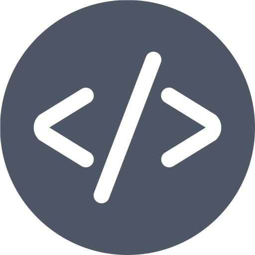

# Coding_Hub

  
**Coding_Hub** is an advanced coding practice platform designed to provide a seamless coding experience. It features a vast collection of questions from popular coding platforms, company-specific challenges, and an integrated compiler for real-time execution.

## 🚀 Features

### 🔐 User Authentication
- Secure user registration and login.
- Email verification and password recovery.
- Ensures data protection and restricted access.

### 📊 Dashboard Overview
- Intuitive dashboard displaying key metrics.
- Track coding progress and performance insights.
- Personalized recommendations based on past performance.

### 📁 Extensive Question Bank
- Questions sourced from **all major coding platforms**.
- **Company-wise questions** for targeted preparation.
- Categorized by difficulty levels and topics.

### 💻 Integrated Compiler
- Supports multiple programming languages.
- Instant execution of code with output visualization.
- Optimized for smooth performance.

### 🔔 Real-time Notifications
- Get alerts for new challenges, coding contests, and updates.
- Stay informed about upcoming competitive programming events.

### 📈 Performance Analytics
- Detailed reporting and insights on coding efficiency.
- Track time complexity and performance comparisons.
- Visual charts to analyze progress over time.

### 📱 Responsive Design
- Fully optimized for **desktop, tablet, and mobile**.
- Ensures a seamless experience across different devices.

### 🔗 Integration with Third-party Services
- Connect with **GitHub**, **LeetCode**, **Codeforces**, and more.
- Allows seamless code submission and synchronization.

### ⚙️ Customizable Settings
- Personalized coding environment with **theme selection**.
- Adjustable **editor preferences** for a better experience.

### 🆘 Help and Support
- Comprehensive **FAQ section** and **documentation**.
- Dedicated support team for troubleshooting.

## 📜 How to Get Started
1. **Visit the website**: [NMS Softwares](https://nmssoftwares.com)
2. **Sign up** and create an account.
3. **Explore the question bank** and start coding.
4. **Use the integrated compiler** to test your solutions.
5. **Track your progress** through performance analytics.

## 🛠️ Tech Stack
- **Frontend**: HTML, CSS, JavaScript
- **Backend**: Python (Flask/Django)
- **Database**: MongoDB / MySQL
- **Compiler Integration**: Docker-based execution
- **Authentication**: OAuth, JWT

## 🤝 Contributing
We welcome contributions! Follow these steps to contribute:
1. Fork the repository
2. Create a new branch (`feature-branch`)
3. Commit your changes
4. Push to the branch and create a PR

## 📄 License
This project is licensed under the **MIT License**.

---
🔗 **Official Website**: [Ashutosh Singh](ashutoshsingh6376@gmail.com)  
📧 **Contact**: support@nmssoftwares.com  
🌟 **Follow us**: [GitHub](https://github.com/nashutosh) | [LinkedIn](https://www.linkedin.com/in/ashutosh-singh-7945812b2/)
